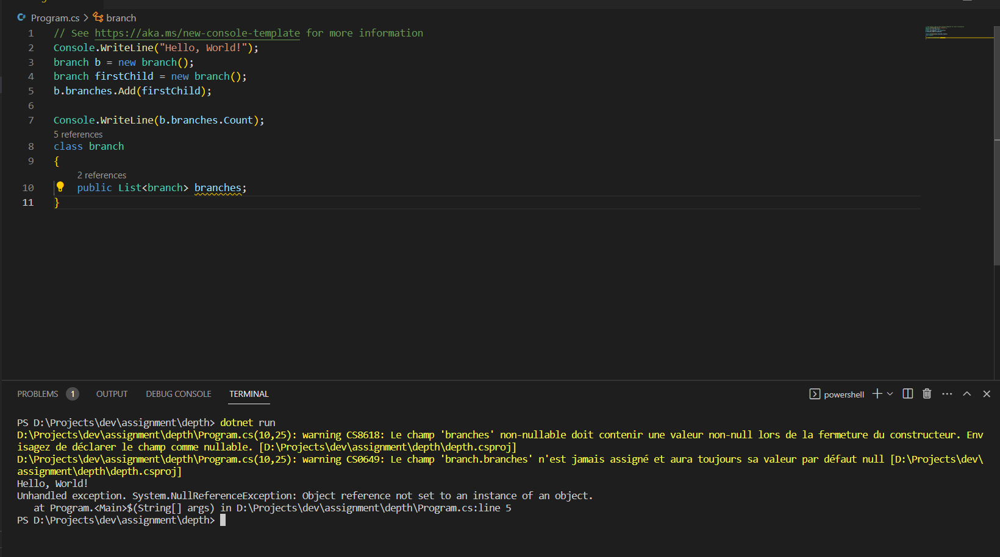
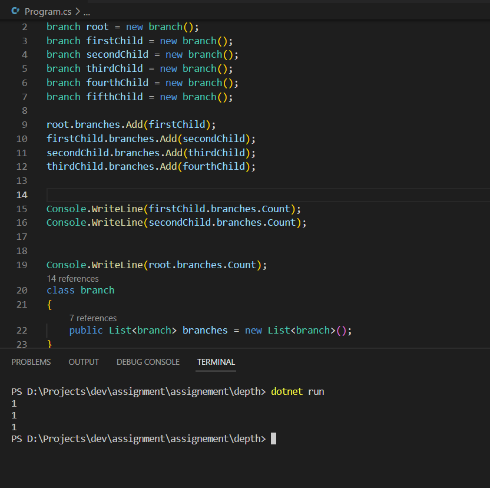
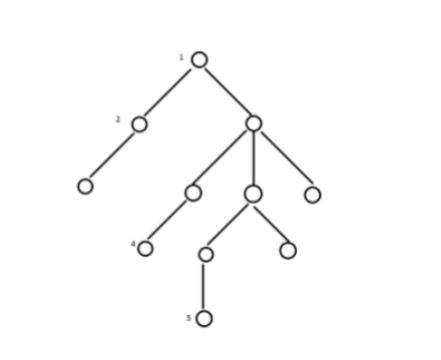
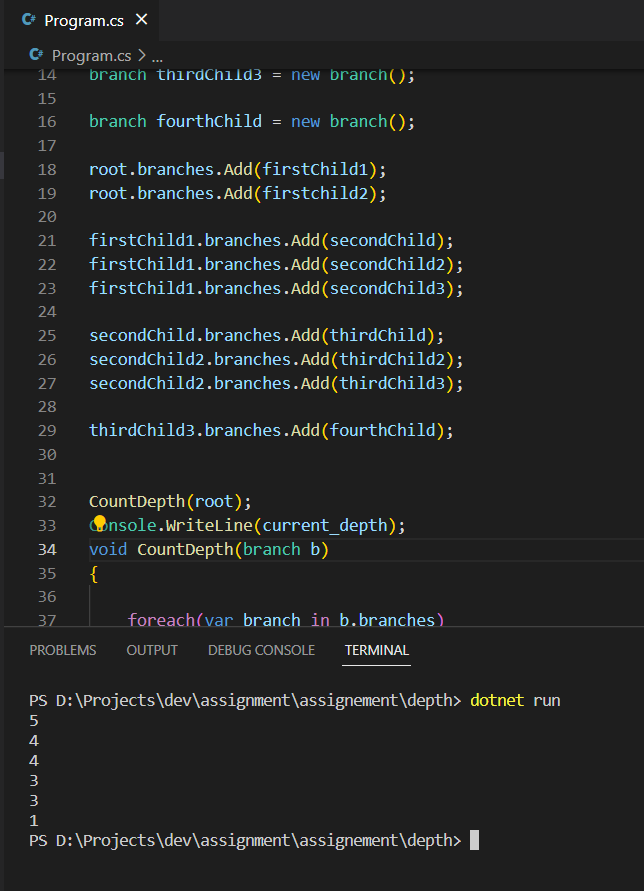

when the class branch is declared with branches variable without being initialized we will have null ref exception :
]

to properly define the branch class with a public variable branches and initialized it as new ``list<branch>``

as follows:

```c#
class branch
{
    public List<branch> branches = new List<branch>();
}
```
to create the first , or root branch and few other branches , then add to it to each other  :
```c#
//creating the branches 
branch root = new branch();
branch firstChild = new branch();
branch secondChild = new branch();
branch thirdChild = new branch();
branch fourthChild = new branch();
branch fifthChild = new branch();
//adding each one as a child to the previous one
root.branches.Add(firstChild);
firstChild.branches.Add(secondChild);
secondChild.branches.Add(thirdChild);
thirdChild.branches.Add(fourthChild);
```

example:

as we can see each branch has exactly one child branch object , to create the exact branches structre as in the assignement :
]
we would create 11 objects :
```c#
branch root = new branch();
branch firstChild1 = new branch();
branch firstchild2 = new branch();
  
branch secondChild = new branch();
branch secondChild2 = new branch();
branch secondChild3 = new branch();
branch secondChild4 = new branch();
  
branch thirdChild = new branch();
branch thirdChild2 = new branch();
branch thirdChild3 = new branch();
  
branch fourthChild = new branch();
```
then create the structure as in the exercise.
now to get the depth i created a method called CountDepth, the idea being , i will itirate throu every child branch object and in every branch get if it has child branches , if so itirate through the branches untill there's no child branches , which means we reach the end of that branch and print the current depth, and repeat the process again on every object , 
``` c
//init the variable current_depth
int current_depth = 1;

void CountDepth(branch b)
{
    
    foreach(var branch in b.branches)
    {
        current_depth++;    
        if(branch.branches.Count > 0)
        {
            
            CountDepth(branch);
        }
        else
        {
            current_depth++;
            Console.WriteLine(current_depth);
            current_depth =1;
        }
        
    }
}
```


this will print every branch depth , then we just store these results in a list or array and get the biggest number ,that would be the depth of the current structure :

```c
//depth list that will hold all the values
List<int> depths = new List<int>();
// instead of console write current_depth we will add that to the list :
depths.Add(current_depth);

//then on main function to return the maximum value from the list:
Console.WriteLine(depths.Max());
```